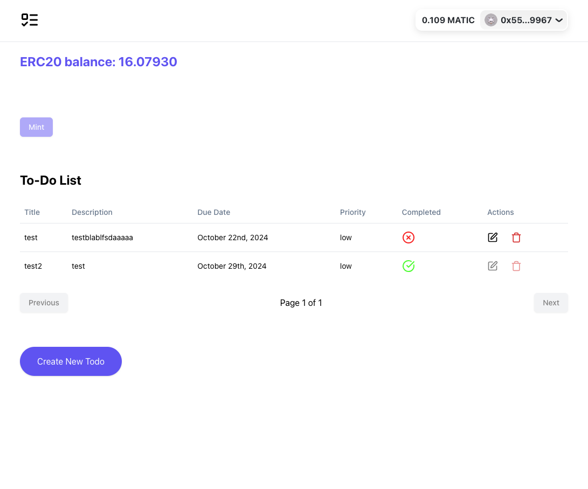
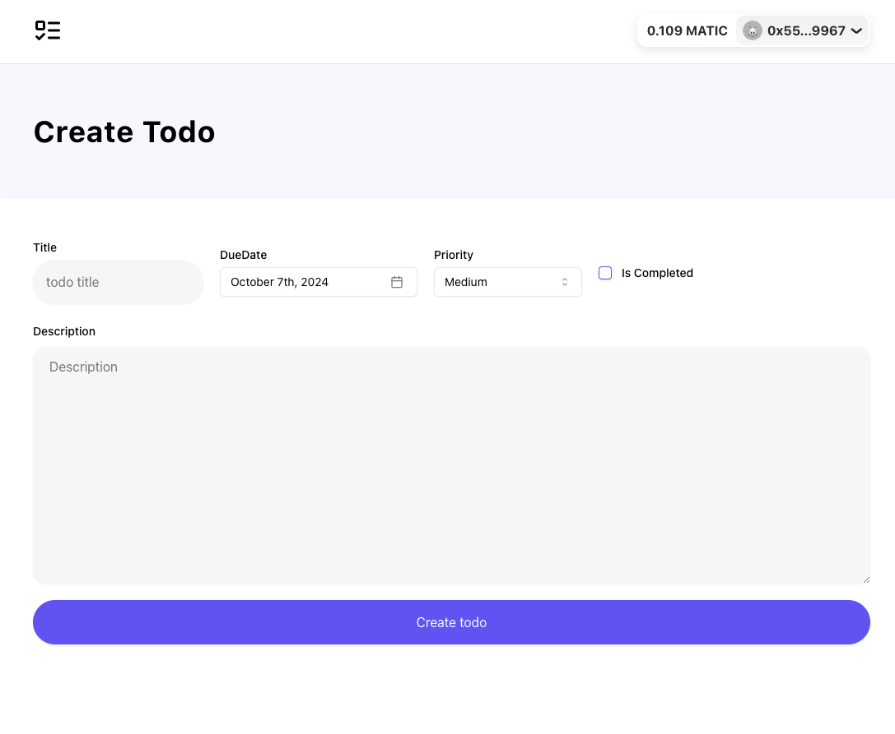

This is a blockchain-integrated to-do list web application using Next.js, TypeScript, and web3 technologies.

## Home Page



## Edit/Create Page



## Deployed URL

- [https://web3-todo-one.vercel.app/](https://web3-todo-one.vercel.app/)

## Backend and running instructions

The project is currently using supabase as Backend-as-a-Service which provides a Postgres database for data storage. Two tables are created:

- Users: Keeps information about unique wallet_addresses
- Todos: Keeps information about todos. There is a column **wallet_address** acting as a foreign key to _users_ table.

You can also run the app locally by uncommenting the code in comments in todo.actions.ts file. In that case an **in-memory** database is used and the backend is next.js itself with **Route Handlers**.

In that case simply run:

```bash
npm run dev
```

Keep in mind that you need to create an **env.local** file and replace the environment variable **NEXT_PUBLIC_PROJECT_ID** as seen in the _.env.example_ file.

## Functional Requirements

The project meets the following actions:

- User Authentication via Web3

  - User logs in via connecting their MetaMask wallet
  - User is required to sign a message with their wallet to properly sign in

- To-Do List Functionality. Authenticated users can:

  - Create to-do items via the provided API
  - Read to-do items via the provided API
  - Update to-do items via the provided API
  - Delete to-do items via the provided API

- Web3 functionalities. Authenticated users can:
  - View current ERC20 token balance
  - Mint an NFT after 2 to do list items are marked completed
    - The mint button is initially disabled until completed the tasks
    - The mint transaction awaits a specified number of blocks
  - Burn the NFT
    - The burn of the NFT sends an amount of an ERC20 token. After successfull burn, the ERC20 balance is updated in the UI.

## Blockchain and Network Info

- Polygon Amoy testnet
  - ERC20 Token Address in the Polygon Amoy Chain `0xf02f35bF1C8D2c3a1e7255FD9AddC8F2182e0627`
  - ERC721 NFT Address in the Polygon Amoy Chain `0x8E1096fd5C8Ca1EFdC1BC2F64Ae439E0888b1A46`

## Technologies used

- [RainbowKit](https://nextjs.org/docs) - to add wallet connection
- [Wagmi](https://wagmi.sh/) - to interact with smart contracts
- [Next Auth](https://next-auth.js.org/) - to add authentication to the app. Middleware is used to redirect users and protect routes
- [React Hook Form](https://react-hook-form.com/) - to create todo form
- [Zod](https://zod.dev/) - to validate schemas
- [Shadcn/ui](https://ui.shadcn.com/) - as a component library
- [Supabase](https://supabase.com/) - as Backend-as-a-Service
